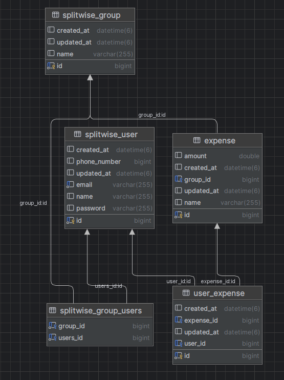

# Splitwise: An expense tracking application (WIP: 👷🔧)
- A RESTFUL API application to track expenses and transactions.
- Currently, this is only a backend application, Frontend - future scope.
- Built using SpringBoot
Connected to MySQL database

### Swagger docs
- http://localhost:8080/swagger-ui/index.html

### Database Schema

Click to expand

### Functional Requirements
- Create users.
- Allow users to create groups and add user to it.
- Allow users to add expenses to the group, including/excluding users
- Allow them to edit expenses
- Simplifying expenses: minimise the number of transactions for final settlement.
- Settle up transactions: pay owed amount.

### Core Entities
- User 
- Group
- Expense
- UserExpense
- Transaction
